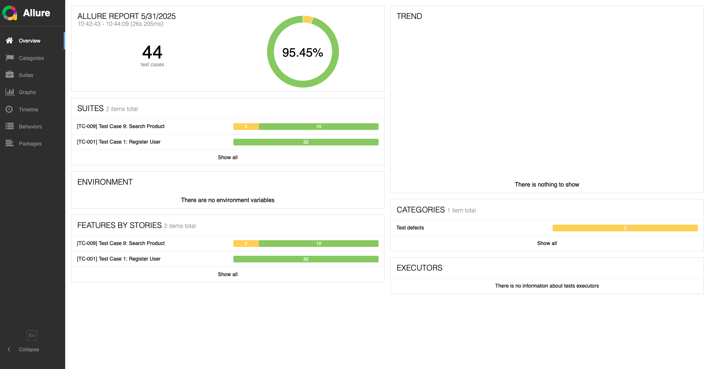
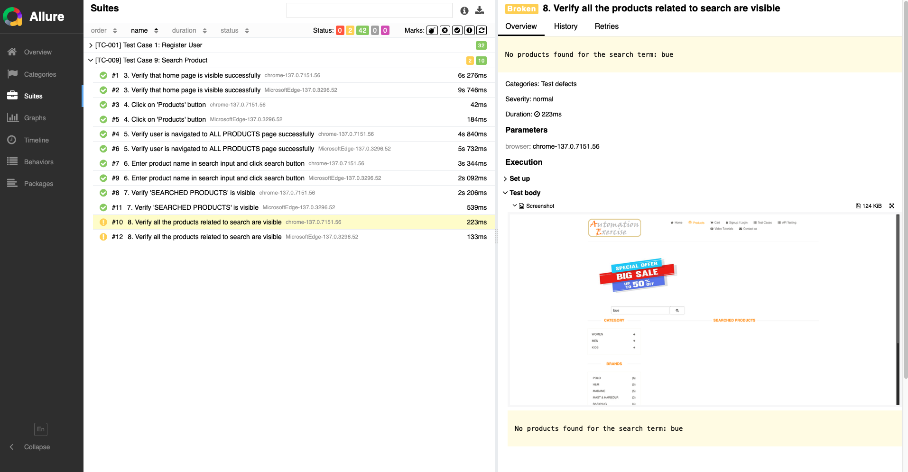

# Projeto de Automação de Testes Web - Automation Exercise
[](https://github.com/pricaimiTech/qa.automationexercise-web.webdriverio/actions/workflows/test-and-report.yml)

## Descrição

Este projeto contém testes automatizados para o site [Automation Exercise](https://automationexercise.com/), desenvolvidos como parte de um desafio de automação. O objetivo é demonstrar boas práticas de automação de testes web, incluindo organização de código, uso de padrões de projeto, e integração com ferramentas de relatório e CI/CD.

**Aplicação Alvo:** [https://automationexercise.com/test_cases](https://automationexercise.com/test_cases)

## Casos de Teste Automatizados

Os seguintes casos de teste foram automatizados neste projeto:

- [x]  **Test Case 1:** Register User
- [x]  **Test Case 9:** Search Product
- [ ]  **Test Case 12:** Add Products in Cart
- [ ]  **Test Case 13:** Verify Product quantity in Cart
- [ ]  **Test Case 17:** Remove Products From Cart

## Tecnologias e Frameworks Utilizados

*   **Framework de Automação:** WebdriverIO
*   **Linguagem:** JavaScript
*   **Gerenciador de Pacotes:** NPM
*   **Relatórios:** Allure Reports
*   **CI/CD:** GitHub Actions
*   **Padrão de Projeto:** Page Object Model (POM) para organização e manutenibilidade do código.
*   **Navegadores:** Chrome e Edge


## Estrutura do Projeto

```bash
. 
├── config/ # Arquivos de configuração do WebdriverIO 
│ └── wdio.conf.js 
├── allure-results/ # Diretório gerado para os resultados brutos do Allure 
├── allure-report/ # Diretório gerado para o relatório HTML do Allure 
├── node_modules/ # Dependências do projeto 
├── img # imagens para o readme
├── src
│ ├── data/ #dados fakes ou mocados 
│ ├── utils/ # Funções utils para a automação
├── test
│ ├── elements/ # mapeamento dos elementos 
│ ├── pageobjects/ # Classes Page Object para interação com as página da aplicação 
│ ├── specs/ # Arquivos de teste (specs) 
├── .github/ # Configurações do GitHub 
│ └── workflows/ 
│ └── main.yml # Workflow do GitHub Actions 
├── .gitignore 
├── package.json 
├── package-lock.json 
└── README.md
``` 


## Pré-requisitos

Antes de começar, certifique-se de ter o seguinte software instalado em sua máquina:

*   [Node.js](https://nodejs.org/) (versão LTS recomendada)
*   [NPM](https://www.npmjs.com/) (geralmente vem com o Node.js) ou [Yarn](https://yarnpkg.com/)
*   [Java Development Kit (JDK)](https://www.oracle.com/java/technologies/javase-jdk11-downloads.html) (versão 8 ou superior, necessário para o Allure Reports)

## Configuração e Instalação

1.  **Clone o Repositório:**
    ```bash
    git clone https://github.com/pricaimiTech/qa.automationexercise-web.webdriverio.git
    cd qa.automationexercise-web.webdriverio
    ```

2.  **Instale as Dependências:**
    Usando NPM:
    ```bash
    npm install
    ```

3.  **Configuração do Allure Commandline (se ainda não tiver):**
    Siga as instruções de instalação do Allure Commandline para o seu sistema operacional: [Allure Framework - Installation](https://allurereport.org/docs/gettingstarted-installation/).
    Certifique-se de que o `allure` esteja adicionado ao PATH do seu sistema.

## Executando os Testes

Os testes são configurados para rodar em modo *headless* por padrão, conforme especificado no arquivo `wdio.conf.js`.

1.  **Pre test: limpando a pasta dos reports**
    ```bash
    npm pretest
    ```

2.  **Para executar todos os testes:**
    ```bash
    npm test
    ```

3.  **Para executar um teste em específico:**
    ```bash
    npx wdio wdio.conf.js --suite test/spec/[nome da spec que deseja rodar]
    ```


## Pipeline de CI/CD com GitHub Actions

Este projeto está configurado com um pipeline no GitHub Actions, definido no arquivo `.github/workflows/test-and-report.yml`.
O pipeline será acionado automaticamente em eventos como `push` para a branch `main` ou em `pull requests` direcionados à `main`.

As etapas do pipeline geralmente incluem:
1.  Checkout do código.
2.  Setup do Node.js.
3.  Instalação de dependências.
4.  Execução dos testes.
5.  Geração e disponibilização do relatório Allure para download

## Estrutura da Automação

O mapeamento de elementos da interface do usuário é realizado utilizando o padrão Page Object Model. Cada página da aplicação possui uma classe correspondente no diretório `pageobjects/` e `elements/`: 
- Na pasta de `elements/`: os elementos são mapeados 
- Na pasta de `pageobjects/`: Nessa classe os métodos são criados para interagir com esses elementos, promovendo reutilização e facilidade de manutenção.

## Report Allure 


Para gerar o relatório utilize o comando abaixo

**Gerar o report:**
    ```bash
    allure generate allure-results && allure open
    ```

Será gerado um `localhost` e a página com o report será exibida 




Ao clicar em um test, será possível ver todos os dados da execução. Inclusive em caso de **falha** como a imagem abaixo, terá uma imagem e o erro informando.


